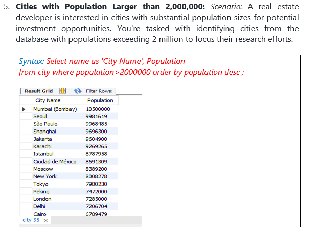
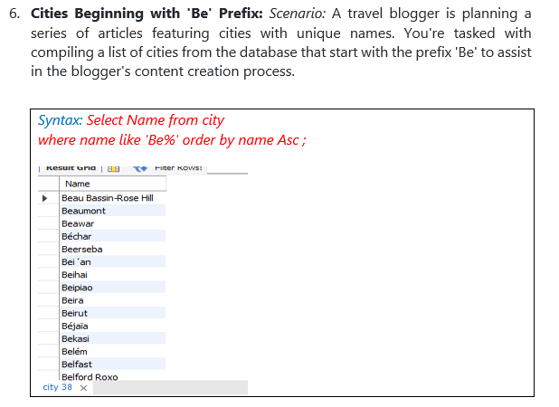
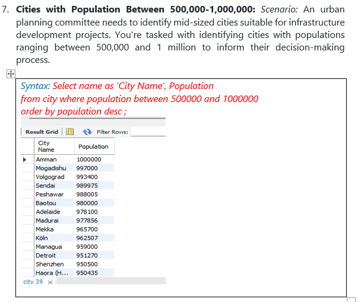
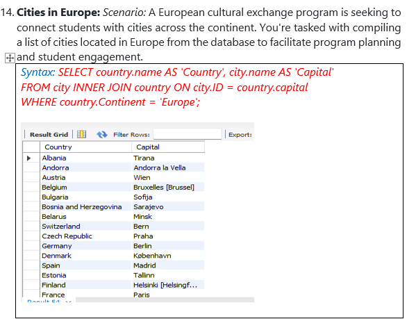
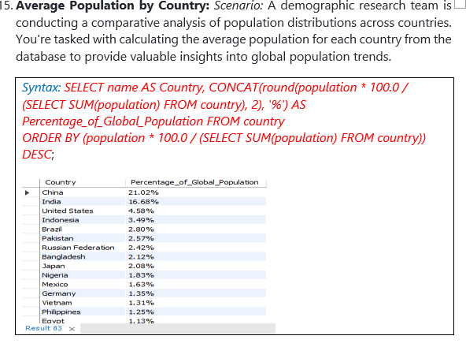
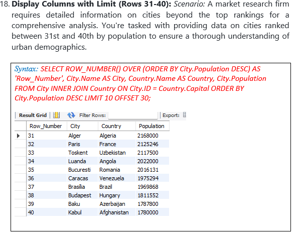
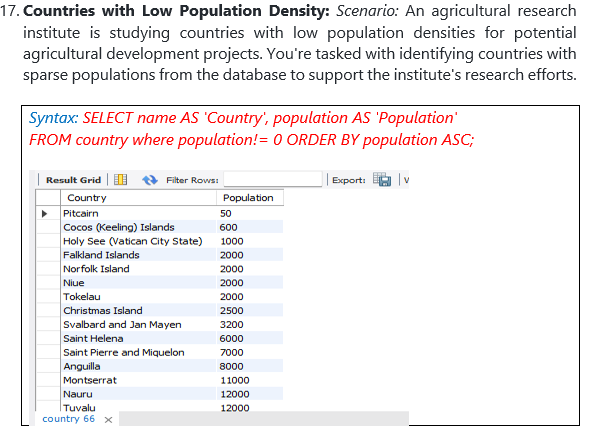
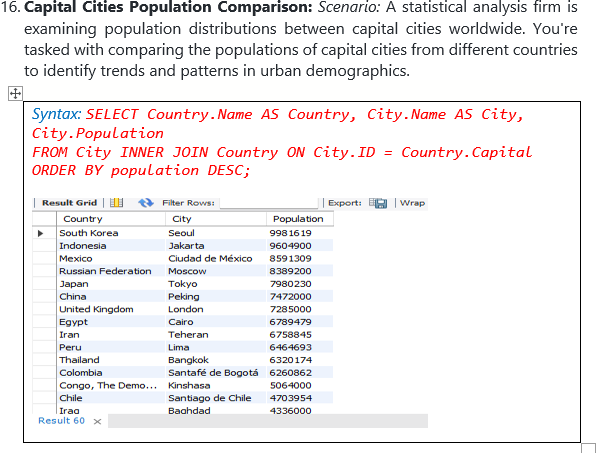

# Settingup-Database-in-MySQL

** In this Project we have used world_db dataset to setting up Database in MySQL**

**Please Download world_db(1) [here](https://justit831-my.sharepoint.com/:u:/g/personal/danpe_justit_co_uk/Ef6vAaaYVi5FhHqKGxqnn60B9g2khoYekEIO3Y7J00UcJQ?e=pv9NNE)**

**Follow each step to create your database [here.](https://justit831-my.sharepoint.com/:b:/g/personal/danpe_justit_co_uk/EdeCKl2Sas1Hl7u9amDy0fIB9jGVCKxSR0u2-lFOvS5rXw?e=xKv1U7)**

**Data Source: Just IT, Google, ChatGPT**

**Full Project work book [here.](https://drive.google.com/file/d/1EjP4p_O01En_aqOt4pdlN-lY31-URIF8/view?usp=drive_link)**

**Click [here](https://github.com/Alamin-analyser/Designing-Database-in-MySQL) to see another MySQL Project.**
